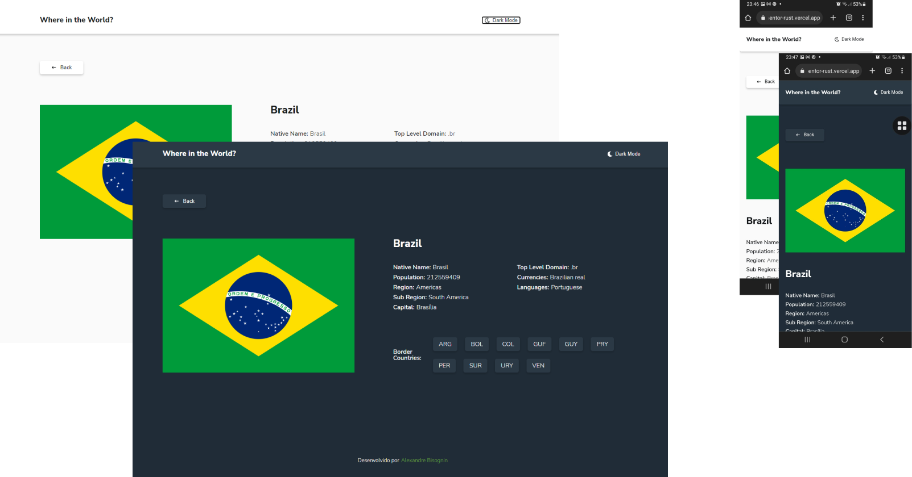

# Desafio do Frontend Mentor - REST Countries API

Esse projeto foi realizado com o objetivo de praticar e aprimorar habilidades de desenvolvimento frontend. O design foi cedido pelo site [Frontend Mentor](https://www.frontendmentor.io/challenges/rest-countries-api-with-color-theme-switcher-5cacc469fec04111f7b848ca). 

### Link
- Live Site URL: [https://countries-api-frontend-mentor-rust.vercel.app/](https://countries-api-frontend-mentor-rust.vercel.app/)

## Requisitos
- Apresentar os dados através da [API REST Countries](https://restcountries.com/)
- Criar um campo de busca por nome do país
- Criar um filtro por continente
- Abrir uma página de detalhes de cada país, quando for clicado
- Criar links para os países de fronteira dentro da página de detalhes
- Desenvolver um botão de troca de tema 'dark' e 'light'

## Screenshot do resultado

### Home page

### Detail page

## Meu processo

### Desenvolvido com

- HTML5 semântico
- CSS
- Flexbox
- Grid
- ReactJS
- Styled Components
- Fetch API
- Context API

### Cronograma
Antes de iniciar o projeto criei um cronograma para organizar e guiar as ações, conforme imagem abaixo.

## Contato

- [Portfólio](https://www.alexandrefb.com)
- [Linkedin](https://www.linkedin.com/in/alexandre-fb/)

